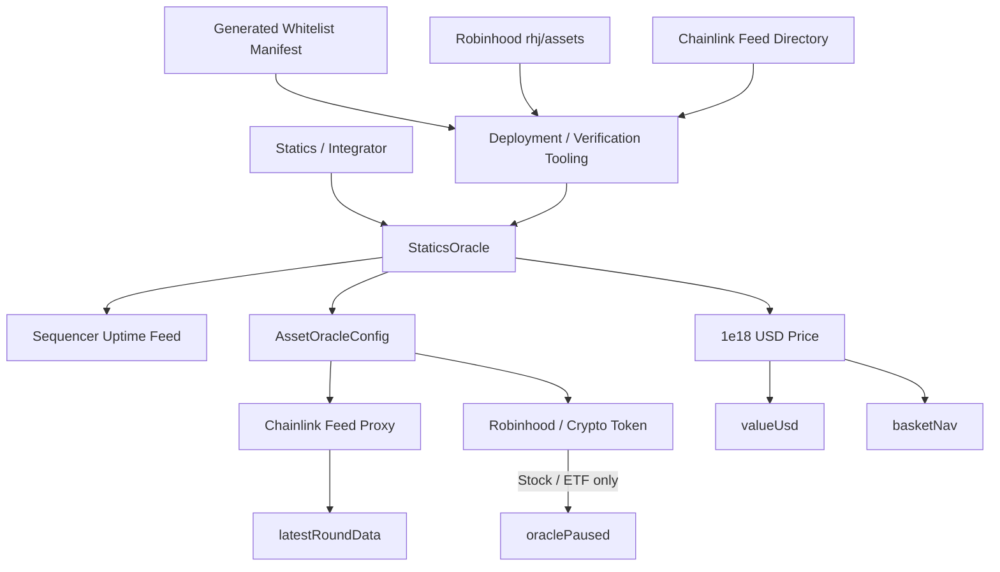
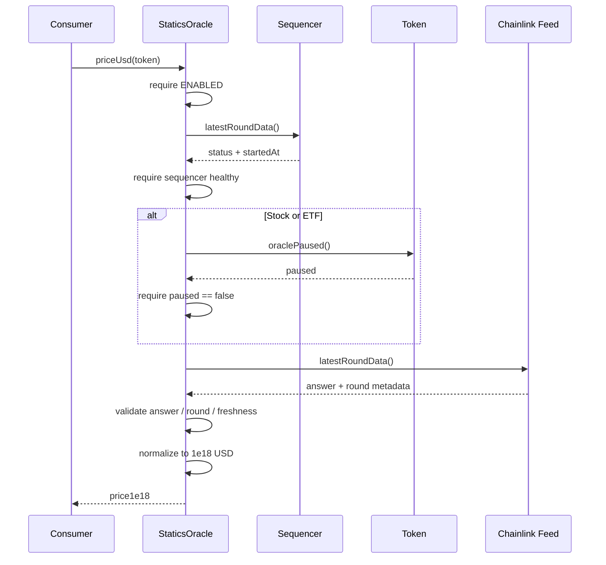
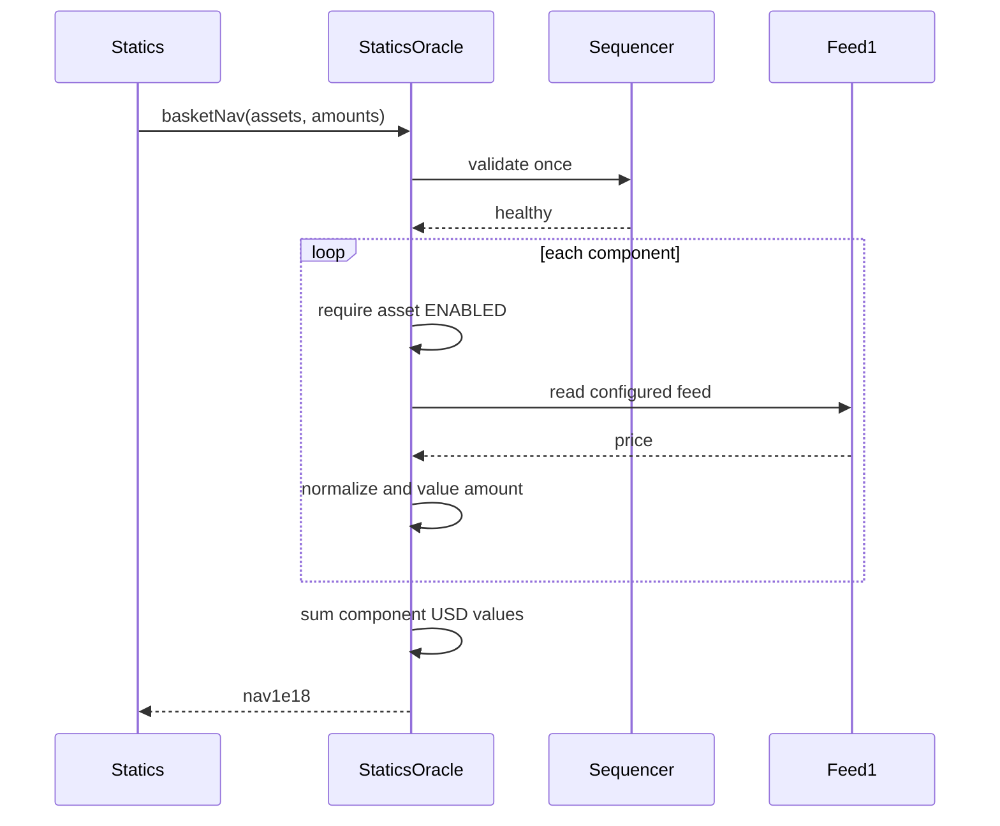
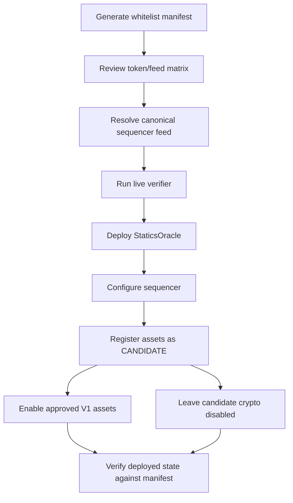

# Design Document: Robinhood Chain Oracle Whitelist

## Overview

`statics-oracle` provides the canonical external-asset pricing layer for Statics on Robinhood Chain.

The system maps exact Robinhood Chain token addresses to exact Chainlink Data Feed proxy addresses and exposes:

1. normalized USD prices,
2. normalized USD value for arbitrary token amounts,
3. aggregate NAV for Statics Basket compositions,
4. diagnostic oracle status information,
5. explicit asset lifecycle management.

The design is intentionally narrow.

V1 supports Chainlink Data Feeds only. It does not implement STATICS pricing, Basket Token TWAPs, DEX fallbacks, Chainlink Data Streams, or Morpho risk logic.

The core implementation SHOULD use a single non-upgradeable `StaticsOracle` contract. This minimizes external calls, duplicate policy logic, and audit surface.

### Key Design Decisions

1. **Exact address bindings, never ticker resolution**

   Oracle configuration is keyed by token contract address.

   `AAPL`, `WBTC`, `BTC`, or any other symbol has no security significance.

   A token is priceable only if its exact contract address has an explicitly approved feed binding.

   Validates Requirements 2, 3, 5, 13.

2. **Single authoritative `StaticsOracle` contract**

   Registry state, price validation, normalization, sequencer protection, and Basket NAV aggregation live in one contract.

   This avoids a separate registry contract calling a separate price contract which then calls another NAV adapter.

   Validates Requirements 8, 9, 12.

3. **Chainlink feed proxies only**

   Configuration stores Chainlink proxy addresses rather than underlying aggregator implementations.

   Feed upgrades therefore do not require Statics configuration changes when Chainlink updates the aggregator behind an unchanged proxy.

   Validates Requirements 3.2, 6.9.

4. **1e18 USD normalization**

   Every valid external price is normalized to 18-decimal USD.

   Basket valuation therefore reduces to:

   ```text
   componentValue = rawTokenAmount × price1e18 / 10^tokenDecimals

   Basket NAV = Σ componentValue
   ```

   Validates Requirements 8 and 9.

5. **Robinhood Stock Token feeds are consumed directly**

   Chainlink's Robinhood tokenized-equity feeds already include Robinhood's `uiMultiplier()`.

   Statics SHALL NOT multiply the oracle answer by `uiMultiplier()` again.

   `uiMultiplier()` is informational from the perspective of Statics pricing.

   Validates Requirement 4.

6. **Corporate-action pause is fail-closed**

   Stock and ETF configurations require `oraclePaused()` checking.

   If a configured Stock Token reports that its oracle is paused, strict price reads revert.

   Validates Requirements 4.6 and 12.6.

7. **Per-asset freshness policy**

   Each asset stores its own `maxAge`.

   There is no global heartbeat assumption.

   This is especially important because crypto and tokenized-equity feeds have different market behavior.

   Validates Requirement 6.

8. **No automatic market-closed classification in V1**

   V1 can determine whether a Chainlink round is fresh according to its configured policy, but it SHALL NOT independently claim that a U.S. equity market is open or closed.

   No canonical onchain Robinhood market-session oracle has been identified in the current specification.

   Therefore:

   - fresh price = usable,
   - stale price = unusable for strict state-changing operations,
   - `oraclePaused()` = explicit corporate-action failure,
   - richer market-session classification may be added separately.

   This avoids introducing a home-grown holiday/session calendar into an oracle security boundary.

9. **Sequencer safety is global**

   Because all supported assets are read on the same Robinhood L2, the sequencer guard is checked once before strict price operations.

   Multi-asset NAV reads SHALL check sequencer health once rather than once per asset.

   Validates Requirement 7.

10. **Configuration changes are explicit and versioned**

    An enabled asset cannot silently receive a new feed binding.

    Material configuration changes require leaving the enabled state first.

    Every mutation increments the global registry version and emits a complete audit event.

    Validates Requirements 10 and 11.

11. **No upgradeable proxy**

    V1 `StaticsOracle` SHOULD be deployed as a normal immutable-code contract.

    Asset configuration remains mutable through controlled administration, but contract code does not change underneath consumers.

    If a fundamentally different oracle architecture is later needed, Statics can explicitly migrate to a new oracle contract.

12. **Simple controlled-launch administration**

    V1 SHOULD use `Ownable2Step`.

    Ownership may later be transferred to a timelock or governance contract without changing oracle semantics.

    No separate role hierarchy is required for V1.

---

# Architecture



## Strict Price Read



## Basket NAV Read



---

# Components and Interfaces

## 1. `StaticsOracle`

**New file**

```text
src/StaticsOracle.sol
```

Primary protocol contract.

Responsibilities:

- store asset oracle configurations,
- manage lifecycle status,
- manage Robinhood sequencer configuration,
- validate Chainlink feed results,
- validate Robinhood Stock Token pause state,
- normalize feed answers to 1e18 USD,
- value arbitrary token amounts,
- calculate multi-asset Basket NAV,
- expose diagnostic status,
- emit versioned configuration history.

Suggested inheritance:

```solidity
contract StaticsOracle is Ownable2Step, IStaticsOracle
```

The contract SHALL NOT be upgradeable in V1.

---

## 2. `IStaticsOracle`

**New file**

```text
src/interfaces/IStaticsOracle.sol
```

Consumer-facing interface.

Suggested surface:

```solidity
interface IStaticsOracle {
    function priceUsd(address token)
        external
        view
        returns (uint256 price1e18);

    function valueUsd(
        address token,
        uint256 amount
    )
        external
        view
        returns (uint256 value1e18);

    function basketNav(
        address[] calldata assets,
        uint256[] calldata amounts
    )
        external
        view
        returns (uint256 nav1e18);

    function peekPrice(address token)
        external
        view
        returns (PriceData memory);

    function assetConfig(address token)
        external
        view
        returns (AssetOracleConfig memory);

    function registryVersion()
        external
        view
        returns (uint64);
}
```

`priceUsd`, `valueUsd`, and `basketNav` are strict protocol-facing reads.

`peekPrice` is diagnostic and status-oriented.

Validates Requirements 8, 9, 12.

---

## 3. Minimal Chainlink Interface

**New file**

```text
src/interfaces/IAggregatorV3.sol
```

Only the required surface SHOULD be imported or declared:

```solidity
interface IAggregatorV3 {
    function decimals() external view returns (uint8);

    function description() external view returns (string memory);

    function latestRoundData()
        external
        view
        returns (
            uint80 roundId,
            int256 answer,
            uint256 startedAt,
            uint256 updatedAt,
            uint80 answeredInRound
        );
}
```

No Chainlink registry lookup is required at runtime.

The approved proxy is stored directly.

---

## 4. Robinhood Stock Token Interface

**New file**

```text
src/interfaces/IRobinhoodStockToken.sol
```

Minimal required interface:

```solidity
interface IRobinhoodStockToken {
    function oraclePaused() external view returns (bool);

    function decimals() external view returns (uint8);
}
```

`uiMultiplier()` MAY be included for testing and diagnostics but SHALL NOT participate in price calculation.

Validates Requirement 4.

---

## 5. ERC-20 Metadata Interface

Use a minimal metadata interface or OpenZeppelin `IERC20Metadata`.

Required at configuration-validation time:

```solidity
function decimals() external view returns (uint8);
```

Symbols are not security-critical.

---

## 6. `OracleMath`

**New file**

```text
src/libraries/OracleMath.sol
```

Responsibilities:

- normalize feed price to 1e18,
- convert raw token units to 1e18 USD value,
- use full-precision multiplication where necessary.

Suggested API:

```solidity
library OracleMath {
    function normalizePrice(
        uint256 answer,
        uint8 feedDecimals
    )
        internal
        pure
        returns (uint256 price1e18);

    function valueUsd(
        uint256 amount,
        uint256 price1e18,
        uint8 tokenDecimals
    )
        internal
        pure
        returns (uint256 value1e18);
}
```

For V1, supported assets have token/feed decimals at or below 18.

Configuration SHOULD reject decimals greater than the supported bound rather than introduce arbitrary precision behavior.

Implementation SHOULD use `Math.mulDiv` where multiplication may overflow intermediate 256-bit values.

---

# Data Models

## `AssetKind`

```solidity
enum AssetKind {
    NONE,
    STOCK,
    ETF,
    CRYPTO,
    STABLE
}
```

`NONE` is reserved for unset state.

## `AssetStatus`

```solidity
enum AssetStatus {
    UNSET,
    CANDIDATE,
    ENABLED,
    DISABLED
}
```

Meaning:

| Status | Strict pricing |
|---|---|
| `UNSET` | No |
| `CANDIDATE` | No |
| `ENABLED` | Yes |
| `DISABLED` | No |

`UNSUPPORTED` is represented by `UNSET`.

Validates Requirement 10.

## `AssetOracleConfig`

Suggested storage structure:

```solidity
struct AssetOracleConfig {
    address feed;
    bytes32 feedDescriptionHash;
    uint32 maxAge;
    uint8 tokenDecimals;
    uint8 feedDecimals;
    AssetKind kind;
    AssetStatus status;
    bool checkOraclePause;
}
```

The token address itself is the mapping key:

```solidity
mapping(address token => AssetOracleConfig config)
    private _assetConfigs;
```

### Rationale

`feed` is the exact approved Chainlink proxy.

`feedDescriptionHash` catches accidental configuration of a valid feed for the wrong pair.

`maxAge` is the asset-specific freshness boundary.

`tokenDecimals` and `feedDecimals` are cached after validation.

`kind` determines stock/ETF-specific safety behavior.

`status` controls lifecycle.

`checkOraclePause` MUST be true for V1 Stock and ETF assets.

---

## Sequencer Configuration

```solidity
struct SequencerConfig {
    address feed;
    uint32 gracePeriod;
}
```

Suggested storage:

```solidity
SequencerConfig private _sequencerConfig;
```

The feed address SHALL remain unresolved in the specification until verified from an authoritative source.

No placeholder address SHALL be deployed.

---

## `OracleStatus`

```solidity
enum OracleStatus {
    VALID,
    UNSUPPORTED,
    CANDIDATE,
    DISABLED,
    SEQUENCER_NOT_CONFIGURED,
    SEQUENCER_DOWN,
    SEQUENCER_GRACE_PERIOD,
    STOCK_ORACLE_PAUSED,
    STOCK_PAUSE_CHECK_FAILED,
    FEED_CALL_FAILED,
    INVALID_PRICE,
    INCOMPLETE_ROUND,
    INVALID_TIMESTAMP,
    STALE_PRICE
}
```

## `PriceData`

```solidity
struct PriceData {
    uint256 price1e18;
    uint256 updatedAt;
    uint80 roundId;
    OracleStatus status;
}
```

`price1e18` MAY contain the last readable normalized answer for diagnostic states such as `STALE_PRICE`.

Consumers SHALL use `status`, not merely `price1e18`, to determine validity.

Strict functions only return when status is `VALID`.

---

# Administration

## Register Asset

Suggested function:

```solidity
function registerAsset(
    address token,
    AssetOracleConfigInput calldata config
)
    external
    onlyOwner;
```

New registrations SHALL begin as `CANDIDATE` unless the implementation provides a separate explicit enable step immediately afterward.

Registration SHALL verify onchain invariants that can be checked deterministically:

- token != zero,
- feed != zero,
- token has code,
- feed has code,
- token `decimals()` equals supplied value,
- feed `decimals()` equals supplied value,
- feed `description()` hash matches supplied expected hash,
- supported decimal bounds,
- `maxAge > 0`,
- Stock/ETF requires pause checking,
- pause method can be queried for Stock/ETF assets.

Canonical Robinhood `/rhj/assets` verification remains deployment/tooling responsibility because it is offchain data.

## Update Asset Configuration

Suggested function:

```solidity
function updateAsset(
    address token,
    AssetOracleConfigInput calldata config
)
    external
    onlyOwner;
```

An `ENABLED` asset SHALL NOT permit material configuration mutation.

Required lifecycle:

```text
ENABLED
   |
   v
DISABLED
   |
   v
configuration update
   |
   v
CANDIDATE
   |
   v
validation
   |
   v
ENABLED
```

## Enable Asset

```solidity
function enableAsset(address token)
    external
    onlyOwner;
```

Before transition to `ENABLED`, the contract SHOULD perform a strict current-state validation:

1. sequencer configuration exists,
2. sequencer is healthy,
3. stock oracle is not paused where applicable,
4. feed call succeeds,
5. answer is positive,
6. round is complete,
7. timestamp is valid,
8. price is fresh.

If any validation fails, enablement reverts.

## Disable Asset

```solidity
function disableAsset(address token)
    external
    onlyOwner;
```

Disabling does not delete configuration.

## Sequencer Configuration

```solidity
function setSequencerConfig(
    address feed,
    uint32 gracePeriod
)
    external
    onlyOwner;
```

Configuration SHALL validate:

- nonzero address,
- contract code exists,
- feed responds to `latestRoundData()`.

Mainnet deployment tooling SHALL independently verify that the address is the canonical Robinhood Chain sequencer uptime feed before use.

---

# Registry Versioning and Audit Trail

Maintain:

```solidity
uint64 public registryVersion;
```

Increment for every configuration mutation:

- asset registration,
- asset configuration update,
- enable,
- disable,
- sequencer configuration change.

Suggested events:

```solidity
event AssetRegistered(
    address indexed token,
    address indexed feed,
    uint64 indexed version,
    bytes32 configHash
);

event AssetUpdated(
    address indexed token,
    address indexed feed,
    uint64 indexed version,
    bytes32 configHash
);

event AssetStatusChanged(
    address indexed token,
    AssetStatus previousStatus,
    AssetStatus newStatus,
    uint64 indexed version
);

event SequencerConfigUpdated(
    address indexed feed,
    uint32 gracePeriod,
    uint64 indexed version
);
```

`configHash` SHOULD commit to the complete effective configuration.

---

# Price Evaluation

## Diagnostic Evaluation

An internal evaluator SHOULD produce `PriceData` rather than immediately reverting:

```solidity
function _evaluatePrice(
    address token,
    bool sequencerAlreadyChecked
)
    internal
    view
    returns (PriceData memory);
```

Evaluation order SHOULD be deterministic.

### Step 1: Lifecycle

```text
UNSET     -> UNSUPPORTED
CANDIDATE -> CANDIDATE
DISABLED  -> DISABLED
ENABLED   -> continue
```

### Step 2: Sequencer

Unless the caller has already checked the sequencer:

- missing config -> `SEQUENCER_NOT_CONFIGURED`
- answer != 0 -> `SEQUENCER_DOWN`
- recovery age <= gracePeriod -> `SEQUENCER_GRACE_PERIOD`

### Step 3: Robinhood Stock Pause

For configurations where `checkOraclePause == true`:

```solidity
oraclePaused()
```

- `true` -> `STOCK_ORACLE_PAUSED`
- failed call -> `STOCK_PAUSE_CHECK_FAILED`

### Step 4: Read Chainlink Feed

Call `latestRoundData()`.

Failure -> `FEED_CALL_FAILED`.

### Step 5: Validate Answer

`answer <= 0` -> `INVALID_PRICE`.

### Step 6: Validate Round

Reject:

```text
updatedAt == 0
answeredInRound < roundId
```

-> `INCOMPLETE_ROUND`.

### Step 7: Validate Timestamp

Reject future timestamps:

```text
updatedAt > block.timestamp
```

-> `INVALID_TIMESTAMP`.

### Step 8: Validate Freshness

```text
block.timestamp - updatedAt > maxAge
```

-> `STALE_PRICE`.

### Step 9: Normalize

Convert answer to 1e18 USD and return `OracleStatus.VALID`.

---

# Strict Pricing Functions

## `priceUsd`

```solidity
function priceUsd(address token)
    external
    view
    returns (uint256 price1e18);
```

Behavior:

```text
evaluate
    |
status == VALID?
   / \
 yes  no
 |     |
return  revert specific custom error
```

## `valueUsd`

```solidity
function valueUsd(
    address token,
    uint256 amount
)
    external
    view
    returns (uint256 value1e18);
```

Formula:

```text
price1e18 = priceUsd(token)

value1e18 =
    amount × price1e18
    -----------------
       10^tokenDecimals
```

Use full-precision multiplication.

---

# Basket NAV

## Interface

```solidity
function basketNav(
    address[] calldata assets,
    uint256[] calldata amounts
)
    external
    view
    returns (uint256 nav1e18);
```

`amounts[i]` represents raw ERC-20 base units.

For Statics this maps directly to the Basket's static underlying `bundleAmounts`.

## Validation

The function SHALL require:

```text
assets.length == amounts.length
assets.length > 0
```

V1 SHOULD cap component count at `16` to match the current Statics Basket asset limit.

Duplicate assets SHOULD be rejected.

## Execution

1. Validate sequencer once.
2. Initialize `nav1e18 = 0`.
3. For each component:
   - evaluate price without repeating sequencer call,
   - require `VALID`,
   - calculate amount value,
   - add to NAV.
4. Return NAV.

Formula:

```text
NAV =
 Σ [amount[i] × price[i] / 10^tokenDecimals[i]]
```

## Example

Basket:

```text
0.1 NVDA
0.3 WETH
0.08 SPY
```

If normalized prices are:

```text
NVDA = 220e18
WETH = 4,000e18
SPY  = 700e18
```

Then:

```text
NVDA contribution = $22
WETH contribution = $1,200
SPY contribution  = $56

NAV = $1,278
```

The Oracle does not know or care that these values represent percentages, weights, or allocation targets.

It only values fixed quantities.

---

# Stock Token Corporate Actions

## Price Rule

For Stock Tokens:

```text
NAV component =
raw token quantity × Chainlink tokenized-equity feed
```

Not:

```text
raw quantity
× uiMultiplier
× Chainlink feed
```

The latter is explicitly incorrect.

## Representative Dividend Example

Before dividend:

```text
uiMultiplier = 1.000
underlying share = $100
Chainlink token price = $100
```

After dividend reinvestment:

```text
uiMultiplier = 1.010
underlying share = $100
Chainlink token price = $101
```

Statics uses:

```text
1 token × $101 = $101
```

No additional multiplier application occurs.

## Representative Split Example

Before split:

```text
underlying = $200
uiMultiplier = 1
token feed = $200
```

After coordinated 10:1 split:

```text
underlying = $20
uiMultiplier = 10
token feed = $200
```

The Basket's economic token value remains continuous.

During the coordinated corporate-action window, `oraclePaused()` causes strict Statics price reads to fail closed.

---

# Sequencer Safety

## Evaluation

Chainlink L2 uptime feeds conventionally return:

```text
0 = up
1 = down
```

V1 SHALL verify the canonical Robinhood deployment before production configuration.

When down: `SEQUENCER_DOWN`.

When back up:

```text
block.timestamp - startedAt <= gracePeriod
```

-> `SEQUENCER_GRACE_PERIOD`.

No strict asset price is returned until the grace period expires.

## Batch Optimization

`basketNav` validates sequencer health once.

It SHALL NOT make one sequencer oracle call per Basket asset.

---

# Machine-Readable Whitelist Manifest

**New file**

```text
config/robinhood-mainnet.assets.json
```

Suggested schema:

```json
{
  "schemaVersion": 1,
  "chainId": 4663,
  "quoteCurrency": "USD",
  "generatedAt": "ISO-8601",
  "verifiedBlock": 0,
  "sources": {
    "robinhoodAssets": "https://api.robinhood.com/rhj/assets",
    "chainlinkDirectory": "https://reference-data-directory.vercel.app/feeds-robinhood-mainnet.json",
    "robinhoodOracleDocs": "https://docs.robinhood.com/chain/oracles-and-price-feeds/",
    "chainlinkEquityDocs": "https://docs.chain.link/data-feeds/tokenized-equity-feeds/robinhood"
  },
  "sequencer": {
    "feed": null,
    "gracePeriod": 0,
    "verified": false
  },
  "assets": []
}
```

Asset entry:

```json
{
  "symbol": "NVDA",
  "kind": "STOCK",
  "status": "ENABLED",
  "token": "0x...",
  "feed": "0x...",
  "tokenDecimals": 18,
  "feedDecimals": 8,
  "feedDescription": "...",
  "feedDescriptionHash": "0x...",
  "heartbeat": 86400,
  "maxAge": 0,
  "checkOraclePause": true,
  "verification": {
    "robinhoodAssetMatched": true,
    "chainlinkFeedMatched": true,
    "tokenCodeVerified": true,
    "feedCodeVerified": true,
    "latestAnswerPositive": true
  }
}
```

The checked-in manifest is reviewable configuration evidence.

The deployed contract remains the runtime source of truth.

---

# Whitelist Generation and Verification Tooling

## Generator

**New file**

```text
scripts/generate-whitelist.mjs
```

Responsibilities:

1. fetch Robinhood `/rhj/assets`,
2. fetch Chainlink Robinhood feed directory,
3. resolve the intended matrix,
4. require exact asset/token matches,
5. require exact Chainlink feed matches,
6. query Robinhood Chain RPC,
7. verify token bytecode,
8. verify token decimals,
9. verify feed bytecode,
10. verify feed decimals,
11. verify feed description,
12. verify positive current answer,
13. record verification block,
14. generate deterministic JSON.

The script SHALL fail rather than silently omit a requested asset.

## Manifest Checker

**New file**

```text
scripts/verify-whitelist.mjs
```

Responsibilities:

- re-run live checks against the checked-in manifest,
- report source drift,
- report contract drift,
- report feed drift,
- report decimal mismatches,
- report missing canonical source entries.

It SHALL NOT automatically rewrite production configuration.

External directory changes are review inputs, not automatic oracle migrations.

---

# Deployment

## Foundry Configuration

Expected project stack:

```text
Foundry
forge-std
OpenZeppelin Contracts
```

Suggested files:

```text
foundry.toml
remappings.txt

src/
├── StaticsOracle.sol
├── interfaces/
│   ├── IStaticsOracle.sol
│   ├── IAggregatorV3.sol
│   └── IRobinhoodStockToken.sol
└── libraries/
    └── OracleMath.sol

script/
├── DeployStaticsOracle.s.sol
└── ConfigureStaticsOracle.s.sol

scripts/
├── generate-whitelist.mjs
└── verify-whitelist.mjs

config/
└── robinhood-mainnet.assets.json

test/
├── unit/
├── fuzz/
└── fork/
```

---

# Deployment Flow



---

# Correctness Properties

## Property 1: Address Isolation

For any approved token `A` and unapproved token `B`, even if:

```text
symbol(A) == symbol(B)
```

pricing `B` SHALL NOT resolve configuration belonging to `A`.

Validates Requirements 2.3, 2.4, 2.5, 13.1.

## Property 2: Wrapper Isolation

For any two token contracts representing economically related assets:

```text
WBTC != cbBTC
```

the existence of a valid configuration for one SHALL NOT make the other priceable.

Validates Requirements 2.6, 5.1 through 5.6, 13.2.

## Property 3: Decimal Normalization

For any valid asset amount and feed price within supported decimal bounds, changing the representation scale without changing economic value SHALL produce the same normalized USD result within integer rounding bounds.

Validates Requirements 8.1, 8.2, 9.4, 9.5, 13.3, 13.4.

## Property 4: Stock Multiplier Single Application

For any Robinhood Stock Token whose Chainlink feed already includes `uiMultiplier()`, changing `uiMultiplier()` SHALL NOT independently modify Statics' arithmetic.

Statics uses only the resulting feed answer.

Validates Requirements 4.2 through 4.4 and 13.5.

## Property 5: NAV Additivity

For valid components:

```text
NAV([A, B], [x, y])
==
valueUsd(A, x) + valueUsd(B, y)
```

subject only to deterministic integer rounding.

Validates Requirement 9.

## Property 6: Invalid Component Invalidates Strict NAV

For any Basket containing at least one component whose oracle status is not `VALID`, strict `basketNav()` SHALL revert.

Validates Requirement 9.7.

## Property 7: Lifecycle Gating

For any asset configuration:

```text
status != ENABLED
```

strict pricing SHALL fail.

Validates Requirements 10.1 through 10.4.

## Property 8: Enabled Binding Cannot Mutate Silently

For an `ENABLED` token, a material configuration update SHALL fail until the asset leaves the enabled state.

Validates Requirements 10.5 and 10.6.

## Property 9: Sequencer Gating

For any otherwise valid enabled asset:

```text
sequencer down
OR
recovery grace active
```

strict price reads SHALL fail.

Validates Requirement 7.

## Property 10: Registry Version Monotonicity

Every successful administrative configuration mutation SHALL increase `registryVersion` by exactly one.

Read-only pricing operations SHALL NOT modify it.

Validates Requirements 10.7 and 11.

## Property 11: No Fallback Pricing

If a configured Chainlink feed becomes invalid, there exists no execution path in V1 through which a DEX price is silently substituted.

Validates Requirements 8.6, 8.7, 14.4.

---

# Error Handling

Use custom errors rather than revert strings.

Suggested errors:

```solidity
error WrongChain(uint256 expected, uint256 actual);

error ZeroAddress();
error UnsupportedAsset(address token);
error AssetNotEnabled(address token, AssetStatus status);

error InvalidTokenDecimals(address token, uint8 decimals);
error InvalidFeedDecimals(address feed, uint8 decimals);
error FeedDescriptionMismatch(address feed);
error InvalidMaxAge();

error SequencerNotConfigured();
error SequencerDown();
error SequencerGracePeriod(uint256 recoveryStartedAt, uint256 gracePeriod);

error StockOraclePaused(address token);
error StockPauseCheckFailed(address token);

error FeedCallFailed(address feed);
error InvalidPrice(address feed, int256 answer);
error IncompleteRound(address feed, uint80 roundId);
error InvalidOracleTimestamp(address feed, uint256 updatedAt);
error StalePrice(address feed, uint256 updatedAt, uint256 maxAge);

error LengthMismatch();
error EmptyBasket();
error TooManyAssets(uint256 count);
error DuplicateAsset(address token);

error AssetAlreadyRegistered(address token);
error AssetMustBeDisabled(address token);
error InvalidStatusTransition(AssetStatus from, AssetStatus to);
```

Strict functions map diagnostic status into these deterministic custom errors.

---

# Testing Strategy

## Unit Tests

### `test/unit/StaticsOracle.Config.t.sol`

Cover registration, duplicate registration, zero token/feed, wrong token decimals, wrong feed decimals, feed description mismatch, invalid max age, Stock/ETF without pause checking, enabled configuration mutation rejection, lifecycle transitions, and registry version increments.

Requirements: 2, 3, 10, 11.

### `test/unit/StaticsOracle.Price.t.sol`

Cover valid price, decimal normalization, zero answer, negative answer, incomplete round, zero timestamp, future timestamp, stale price, feed call failure, unsupported token, candidate token, and disabled token.

Requirements: 6, 8, 12, 13.

### `test/unit/StaticsOracle.Stock.t.sol`

Cover valid Stock Token, `oraclePaused == true`, pause-call failure, `uiMultiplier()` not used in arithmetic, dividend multiplier scenario, and split multiplier scenario.

Requirements: 4, 13.

### `test/unit/StaticsOracle.Sequencer.t.sol`

Cover missing sequencer config, sequencer up, sequencer down, recovery grace, grace expiry, and malformed sequencer response.

Requirements: 7, 12, 13.

### `test/unit/StaticsOracle.Nav.t.sol`

Cover one asset, multiple assets, mixed token decimals, mixed feed decimals, zero component amount, mismatched arrays, empty basket, duplicate component, over 16 components, one invalid component invalidates NAV, and expected fixed-basket NAV examples.

Requirements: 8, 9, 13.

## Fuzz / Property Tests

### `test/fuzz/OracleMath.t.sol`

Fuzz `amount`, `price`, `tokenDecimals`, and `feedDecimals` within supported ranges.

### `test/fuzz/NavProperties.t.sol`

Prove NAV additivity within deterministic rounding bounds.

### `test/fuzz/AddressIsolation.t.sol`

Generate arbitrary unregistered addresses and same-symbol mocks and prove no symbol collision can access another asset's configuration.

## Robinhood Mainnet Fork Tests

### `test/fork/RobinhoodFeeds.t.sol`

Against chain ID `4663`, for each enabled V1 row verify token code, feed code, configured token decimals, configured feed decimals, feed description hash, latest positive answer, and Stock/ETF pause surface.

These tests SHOULD load or derive expectations from the checked-in manifest rather than duplicate constants manually across test files.

### `test/fork/WhitelistMatrix.t.sol`

Validate the entire enabled manifest against live Robinhood Chain state.

Candidates SHOULD also be checked for identity and feed integrity even though they are not usable for strict pricing.

---

# CI

Suggested CI sequence:

```text
forge fmt --check
forge build
forge test
scripts/verify-whitelist.mjs
```

Live source verification MAY be separated from deterministic unit CI if upstream network availability would otherwise make every pull request flaky.

Recommended split:

```text
PR CI:
- format
- build
- unit
- fuzz

Scheduled / release validation:
- live whitelist verification
- Robinhood fork tests
```

No live verification failure SHOULD automatically rewrite configuration.

It should block or alert for human review.

---

# Integration With Statics

The current Statics Basket model uses static underlying amounts.

The integration boundary therefore remains simple.

Statics supplies:

```text
assets[]
bundleAmounts[]
```

to:

```solidity
basketNav(assets, bundleAmounts)
```

The oracle returns NAV in `1e18` USD.

Statics does not need rebalancing logic, portfolio percentages, stock corporate-action calculations, wrapper-symbol inference, or Chainlink-specific decimal logic.

This preserves the core Statics Basket invariant:

```text
the underlying quantities are static;
only their external USD values change.
```

A later Statics integration can either call `basketNav()` directly or consume `priceUsd()` / `valueUsd()` as primitives.

---

# Security Boundaries

The system trusts:

1. the explicitly configured Chainlink proxy,
2. Chainlink's published answer,
3. Robinhood's `oraclePaused()` signal for configured Stock Tokens,
4. the configured Robinhood L2 sequencer uptime feed,
5. the administrator controlling whitelist configuration.

The system does not trust:

- token symbols,
- token names,
- arbitrary wrapper equivalence,
- DEX spot prices,
- third-party token lists,
- automatically discovered new Chainlink feeds,
- changed external directory entries without review.

---

# Explicit Non-Goals

V1 SHALL NOT implement:

- STATICS/USD oracle pricing,
- STATICS TWAPs,
- Basket Token TWAPs,
- DEX fallback pricing,
- multiple competing oracle providers,
- medianization across oracle providers,
- Chainlink Data Streams,
- automatic feed discovery,
- automatic whitelist additions,
- dynamic Basket rebalancing,
- Morpho LLTV selection,
- liquidation logic,
- market-session calendar infrastructure.

These belong in later specs if required.

---

# Requirement Traceability

| Requirement | Design Coverage |
|---|---|
| 1 | Network scope, deployment configuration |
| 2 | Address-keyed `AssetOracleConfig` |
| 3 | manifest generator, live verifier, registration validation |
| 4 | Stock Token pricing and pause handling |
| 5 | exact wrapper/feed bindings |
| 6 | `_evaluatePrice` validation pipeline |
| 7 | global sequencer configuration and guard |
| 8 | `priceUsd`, `valueUsd`, `PriceData` |
| 9 | `basketNav` |
| 10 | lifecycle state machine and versioned config |
| 11 | checked-in JSON manifest and events |
| 12 | `OracleStatus` and custom errors |
| 13 | unit, fuzz, and fork tests |
| 14 | explicit non-goals and narrow V1 architecture |
